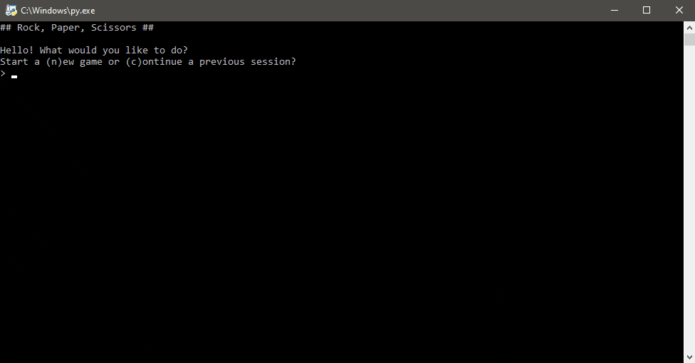

# Rock Paper Scissors
Play an infinite game of Rock Paper Scissors. Score progress is save-able.

## Table of Contents
- [Gameplay](#Gameplay)
  - [Rules](#Rules)
  - [Demo](#Demo)
- [Built With](#Built-With)
- [Running the Game](#Running-the-Game)
- [License](#License)
- [Donations (Optional)](#Donations-(Optional))

## Gameplay
### Rules
If you're unfamiliar with the game Rock Paper Scissors, the rules are simple. Here are the instructions specific to this version:
1. The player chooses Rock, Paper, or Scissors.
    - The player does this by typing `r` for rock, `p` for paper, or `s` for scissors and then hitting `enter`.
2. The computer will randomly make a choice.
3. Both the player's and computer's choices will be displayed on screen and who won.
    - Rock beats Scissors
    - Scissors beats Paper
    - Paper beats Scissors
    - Matching choices will result in a tie

### Demo
Below is a demo of the game running. You can save your progress at any point by typing and entering `save`.

## Built With
- [Python 3.8](python.org) with the help of the built-in modules:
    - os
    - random
    - pickle
    - sys
    - time

## Running the Game
- Install Python 3.6 or newer.
    - You can grab the latest copy from http://python.org.
- Download the `rps.py`.
- Run `rps.py` and enjoy.

## License 
Distributed under the MIT License. See `LICENSE` for more information.

## Donations (Optional)
Ko-fi is basically a virtual tip jar where you can support creatives for about the price of a cup of coffee.

At this time, I'm not very active on Ko-fi nor do I offer any rewards. If you love my work and feel like supporting me, hit the button below to get started.

Tipping is optional but I will appreciate any amount you choose to donate. Thank you (´• ω •`) ♡ !

